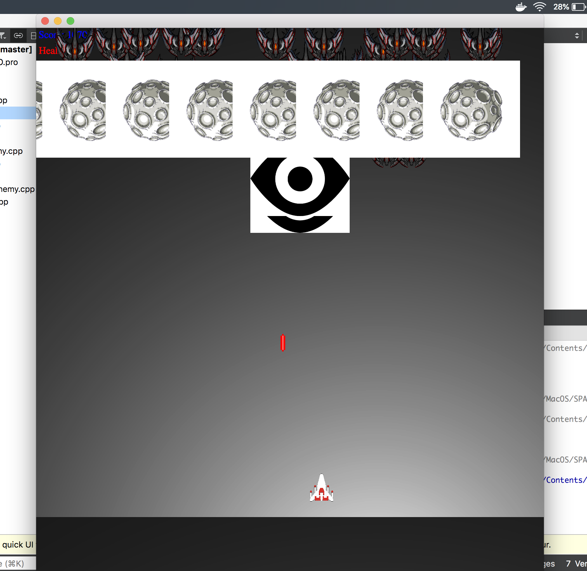
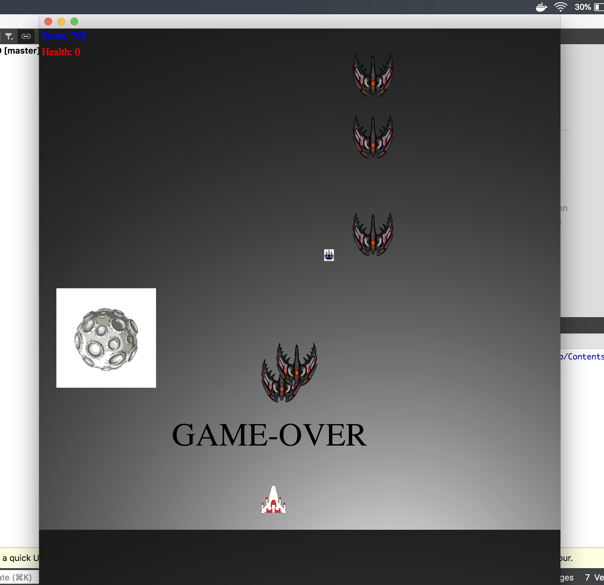
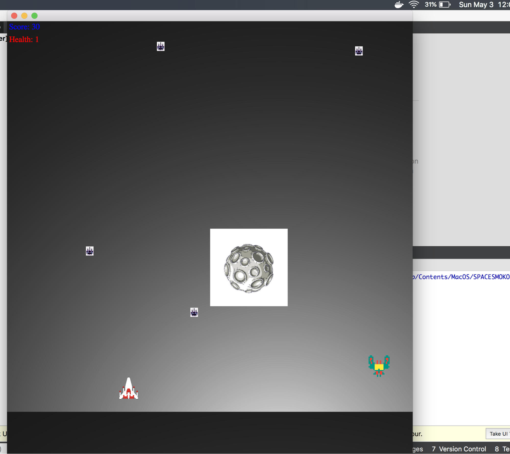
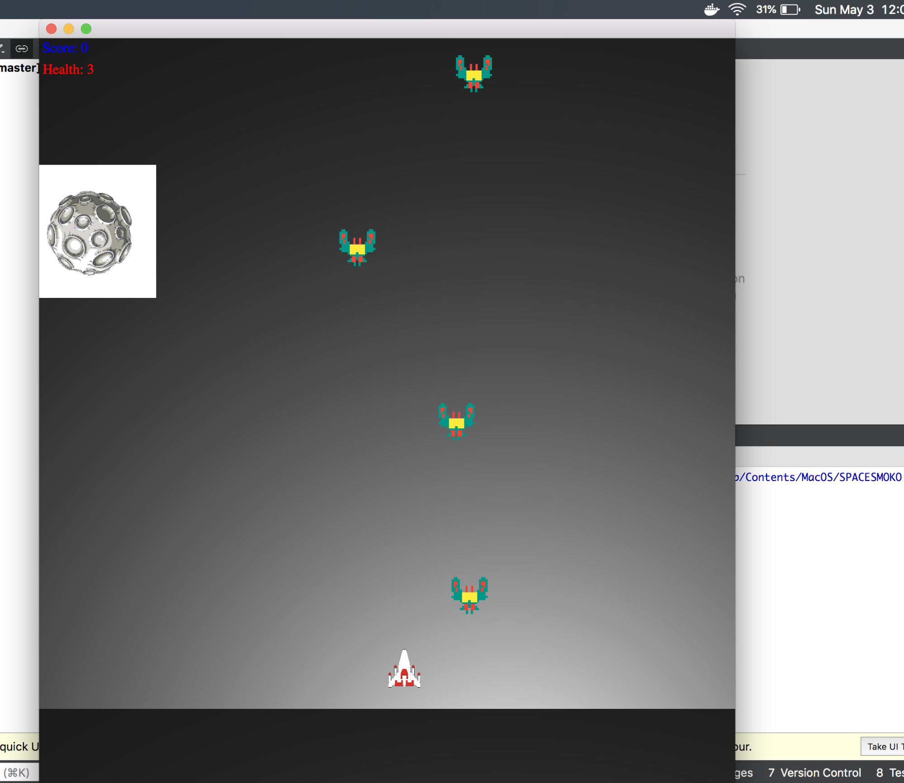
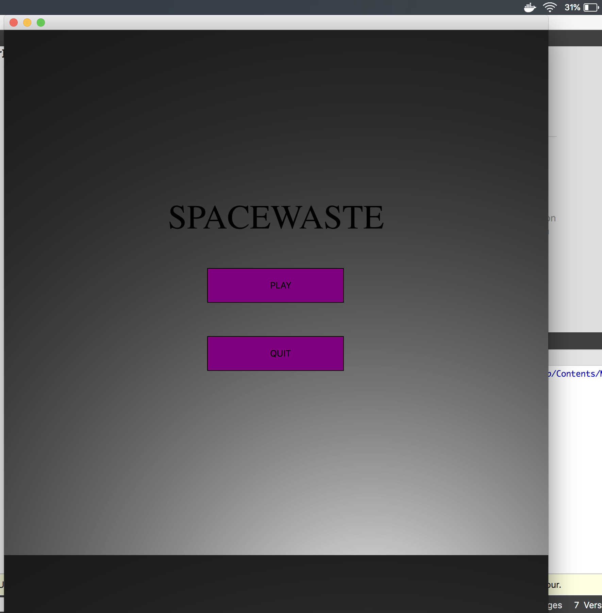

1.  The next deadline will be putting it all together. Finish level 1 go
    to level 2, 3, etc. Boss fight. I have music and sound effects, they
    live on a computer I can't get to at the moment but I'd like to get
    more effects. Levels will start and continue until death or end.
    Name will be prompted. Weapon drops/seamless change,
    scoreboard/health rework (needs to die or lose health on impact),
    boss fight, level iteration, and graphic buffs are things TODO.

2.  I made multiple enemy types with multiple attack patterns. Most of
    them have different attack patterns for the boss fight although they
    all have different spawn types. I made a boss fight as level 4 and
    created a sequential game order. I made a start screen, very basic,
    play/quit. It was great for testing because the slot called from the
    play button could be used to test each level. The score now dictates
    whether the player will call the next level, so more time will be
    spent on different levels depending on how accurate the player is.
    Ending in a boss fight. Lives now increment properly upon impact and
    obstacles can end the game or drop extra ammo required to beat the
    boss. Most of my time was spent on the enemies doing things like
    attacking, spawning, killing the player, etc. I also incorporated
    inheritance and singleton design methods.

I did not add music or sound effects. I did not include treasure, as
much like pac-man fruits, treasure drops are just a distraction that
offers little benefit to the game. My biggest quarrel and shortcoming I
feel is the scoreboard and health system. Because there can only be one
of each as well as only one player I could not find a way to display
pixelmaps of my ships instead of text lives/health. I considered doing
hearts or something different but I wanted it tied directly to the ship.
Changing it from text actually broke the entire game.

3.  I plan to continue with this project. It’s ugly, there’s no way
    around that. I have some wav files for laser blasts, an explosion,
    and some classical music which sounds great for a boss fight. I
    would also like to fix the sprites. Despite looking for vectors and
    all the images being labeled vectors online many are squares. I
    think spending time to just make my own would be best. While the
    functionality is all there sizing, scaling, different speeds, and
    just more content can be added. I think this is more than a resume
    builder because I still see a vision for this game. I actually nixed
    an entire boss attack because it eats lots of memory. A classmate
    suggested a Touhou fight where there are so many lethal items that a
    player can only win by memorizing the attacks and moving almost
    perfectly to avoid them. Flyweight would be a great way to implement
    this. I had the most fun imagining different ways for enemies to
    move and would actually like to continue making more.

4.  

